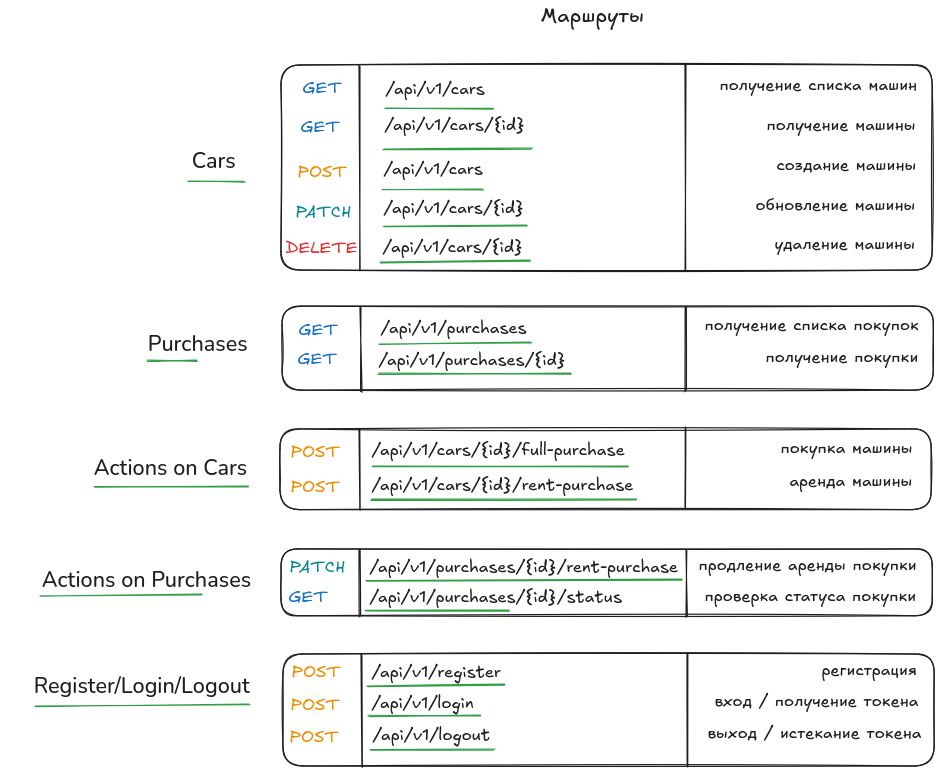
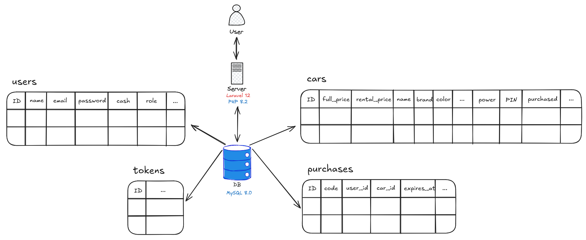
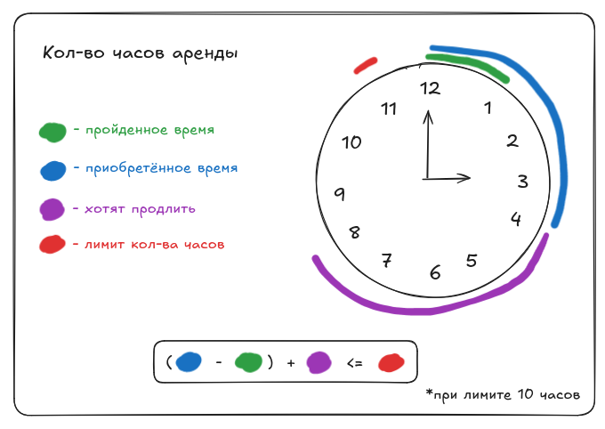

# Тестовое задание на вакансию junior php laravel разработчика

[](https://qlty.sh/gh/NikolaiProgramist/projects/keep-code-test-assignment)

## Краткий обзор

Проект является **REST API** сервисом по покупке и аренде машин. Основные условия выполнены.
При просмотре машины, вы можете получить цены и характеристики.
Если же машина была приобретена каким либо из двух способов, то при просмотре машины, вы также получите `PIN-код`, для доступа к ней (гипотетический доступ). Данный код добавлен для демонстрации авторизации, так как его не могут видеть пользователи, которые не приобрели машину.
Также при проверке статуса вашей покупки, генерируется `UUID`, который связывает между собой аккаунт пользователя, покупку, а также машину.
Данный `UUID` является подтверждением подлинности покупки.
Также в проекте присутствуют роли: `admin` и `user`. Admin может создавать новые машины и обновлять их.
Ниже вы можете посмотреть инструкции по запуску проекта, а также его схему.

## Установка

Клонирование репозитория:

```bash
git clone https://github.com/NikolaiProgramist/keep-code-test-assignment.git
cd keep-code-test-assignment
```

Создайте пустую базу данных `Mysql` и введите данные для подключения к ней в `.env.example` файле:

```php
DB_DATABASE=db_name
DB_USERNAME=username
DB_PASSWORD=password
```

Далее переименуйте файл `.env.example` в `.env`:

```bash
mv .env.example .env
```

Установите зависимости:

```bash
composer install
```

Накатите миграции:

```bash
php artisan migrate
```

Заполните таблицы тестовыми данными:

```bash
php artisan db:seed --class=UserSeeder
php artisan db:seed --class=CarSeeder
```

Запустите сервер:

```bash
php artisan serve
```

Запустите фоновые `schedule` задачи:

```bash
php artisan schedule:work
```

Это необходимо для автоматического удаления просроченных токенов,
а также удаления просроченной аренды.

После всего проделанного, вы сможете получить доступ к api на `localhost:8000/api/v1/`.

В базе данных присутствует администратор, вот его данные для аутентификации:

email: admin@mail.ru
password: test1234

Вы также можете использовать коллекцию `postman` для тестирования.
Она располагается в директории `files/`.

## Схема проекта

Маршруты:



База данных:



Формула подсчёта лимита часов для продления аренды (в проекте используется лимит 24 часа):


